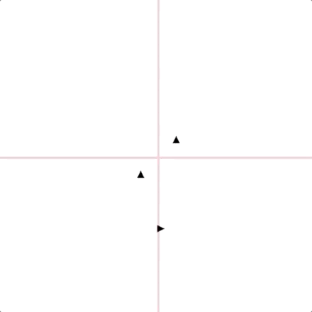

# Turtz

I remember when I was a kid playing alot with
[Logo](https://en.wikipedia.org/wiki/Logo_(programming_language)). You can actually
take a trip down memory lane thanks to an Apple II emulator written in JS:

<https://www.scullinsteel.com/apple2/#logo>

After I did this, I found that I was probably remembering my experiences better than
it actually was. So I set about thinking what a modern equivalent might look like. I
decided it should have the following attributes:

1. Demonstrate some elements of functional programming:

- Create lists of steps rather than a set of procedural commands.
- Support composability through the ability to define a function which produces
  a series of steps, and be able to invoke that command within another series of
  instructions.

2. Seek to simple geometry.

3. Create a "render" system agnostic way of demonstrating how the instructions are
 executed. At present, only a 2D canvas renderer is supported, however, I believe
 this could easily be extended to other graphical formats and potentially even to
 something like [NodeBots](http://nodebots.io/).


[](https://nodei.co/npm/turtz/)

[](https://www.bithound.io/github/DamonOehlman/turtz) 

## Code Example

The following is a rather long code sample, that I'll break into smaller parts in
the future:

```js
// @flow

const {
  Pen,
  Move,
  Turn,
  Path,
  Surface
} = require('turtz');

const { repeat } = require('turtz/logic');

function square(size: number) {
  return [
    Pen.down(),
    repeat(4, [
      Move.forward(size),
      Turn.right(90)
    ]),
    Pen.up()
  ];
}

const triangle = (size) => [
  Pen.down(),
  repeat(3, [
      Move.forward(size),
      Turn.right(360 / 3)
  ]),
  Pen.up()
];

const poly = (sides, size) => [
  Pen.down(),
  repeat(sides, [
    Move.forward(size),
    Turn.right(360 / sides)
  ]),
  Pen.up()
];

const lineAndSquare = [
  Pen.down(),
  Turn.right(90),
  Move.forward(50),
  Turn.left(45),
  square(50),
];

Surface.create({}, surface => {
  return [
    surface.draw(lineAndSquare, 0, -100),
    surface.draw(square(50), -25, -25),
    surface.draw(poly(10, 50), 25, 25)
  ];
});

```

This generates the following output:



## License(s)

### MIT

Copyright (c) 2017 Damon Oehlman <damon.oehlman@gmail.com>

Permission is hereby granted, free of charge, to any person obtaining
a copy of this software and associated documentation files (the
'Software'), to deal in the Software without restriction, including
without limitation the rights to use, copy, modify, merge, publish,
distribute, sublicense, and/or sell copies of the Software, and to
permit persons to whom the Software is furnished to do so, subject to
the following conditions:

The above copyright notice and this permission notice shall be
included in all copies or substantial portions of the Software.

THE SOFTWARE IS PROVIDED 'AS IS', WITHOUT WARRANTY OF ANY KIND,
EXPRESS OR IMPLIED, INCLUDING BUT NOT LIMITED TO THE WARRANTIES OF
MERCHANTABILITY, FITNESS FOR A PARTICULAR PURPOSE AND NONINFRINGEMENT.
IN NO EVENT SHALL THE AUTHORS OR COPYRIGHT HOLDERS BE LIABLE FOR ANY
CLAIM, DAMAGES OR OTHER LIABILITY, WHETHER IN AN ACTION OF CONTRACT,
TORT OR OTHERWISE, ARISING FROM, OUT OF OR IN CONNECTION WITH THE
SOFTWARE OR THE USE OR OTHER DEALINGS IN THE SOFTWARE.
